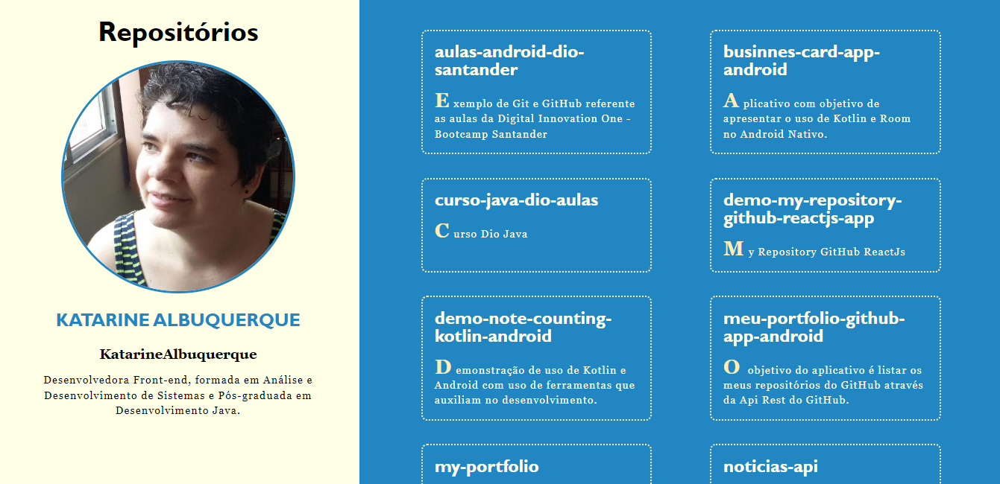

<h1 align="center">Meu Repositório GitHub</h1>
<h2 align="center">React Js</h2>
<h2 align="center">I. Sobre</h2>

<h4 align="center">Demonstrar a lista dos repositórios do GitHub através do Axios em React Js.</h4>

<h2 align="center">II. Layout do Projeto</h2>

    

<h2 align="center">III. Tecnologias Utilizadas</h2>

React Js

Axios

<h2 align="center">IV. Autor</h2>
<h4 align="center">
    <i>Linkedin: </i>
    <a href="https://www.linkedin.com/in/katarine-albuquerque/">/ katarine-albuquerque</a>
</h4>
<h4 align="center">
    <i>GitHub: </i>
    <a href="https://github.com/KatarineAlbuquerque">/ KatarineAlbuquerque</a>
</h4>
<h4 align="center">
    <i>Protfólio: </i>
    <a href="https://github.com/KatarineAlbuquerque/my-portfolio">/ my-portfolio</a>
</h4>
